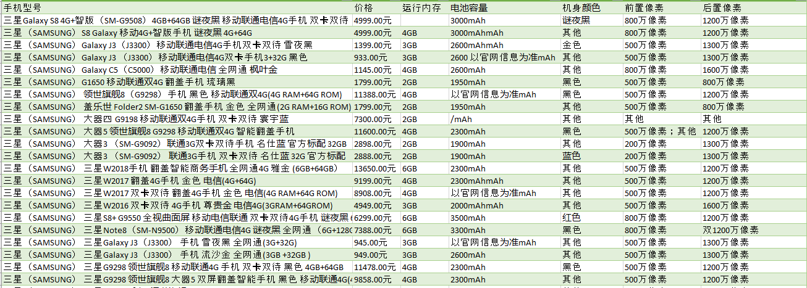

# FILES
* analysis
    * dependency:
        * scrapy
    * url for Samsung phone
        * [url](http://list.jd.com/list.html?cat=9987,653,655&ev=exbrand_15127&page=1&sort=sort_rank_asc&trans=1&JL=6_0_0#J_main)
``` js
Xpath for requirement:
_x_query = {
    'next_page': '//*[@id="J_topPage"]/a[2]/@href',
    'all_items': '//div/@data-sku',
    'url': 'div/div[@class[p-img]/a/@href]',
    'item_id': '//ul[@class="parameter2 p-parameter-list"]/li[2]/@title',
    'name': 'normalize-space(//div[@class="sku-name"]/text())',
    'name_img': 'normalize-space(//div[@class="sku-name"]/img/following::text())',
    'mem': '//*[@id="detail"]/div[2]/div[2]/div[1]/div[6]/dl/dd[4]/text()',
    'eleCap': '//*[@id="detail"]/div[2]/div[2]/div[1]/div[10]/dl/dd[1]/text()',
    'color': '//*[@id="detail"]/div[2]/div[2]/div[1]/div[2]/dl/dd[1]/text()',
    'precam': '//*[@id="detail"]/div[2]/div[2]/div[1]/div[8]/dl/dd[1]/text()',
    'postcam': '//*[@id="detail"]/div[2]/div[2]/div[1]/div[9]/dl/dd[3]/text()'
}
```
* jd_samsung.py
    * Spider Program
    * Get Samsung phone sold in JD
    * Write result to res.spider
* items.py
    * Define PhoneItem to store info
* pipelines.py
    * Store result into csv file

# Usage
``` sh
scrapy crawl jd_samsung
```

# Result

The file is utf-8 encoding.

# Analysis
无误的数据大概占一半左右，其余的或多或少在某一项上存在找不到的问题，
原因是京东的页面并不是都完全一样，有些商品，例如全球购，页面布局有偏差

# Further
因为有一些网页的布局和别的不一样，所以导致用一种XPATH无法获得所有数据，
没有获得到的设置为None，后续改进可以加入更多，满足更多条件的XPATH

